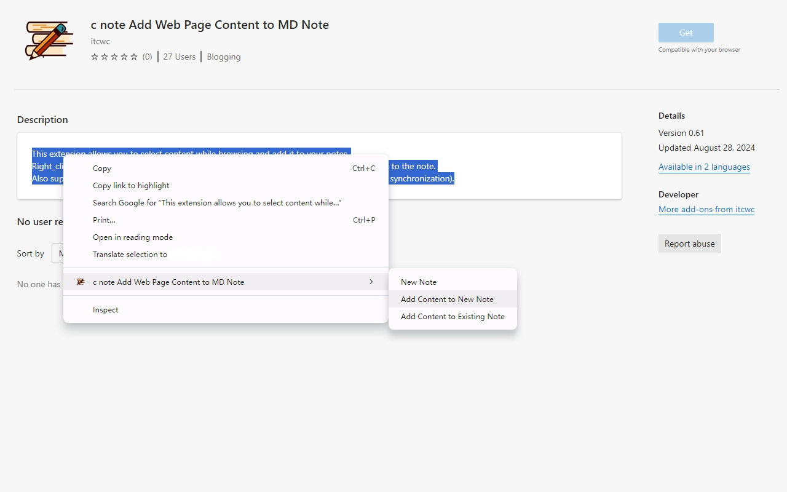
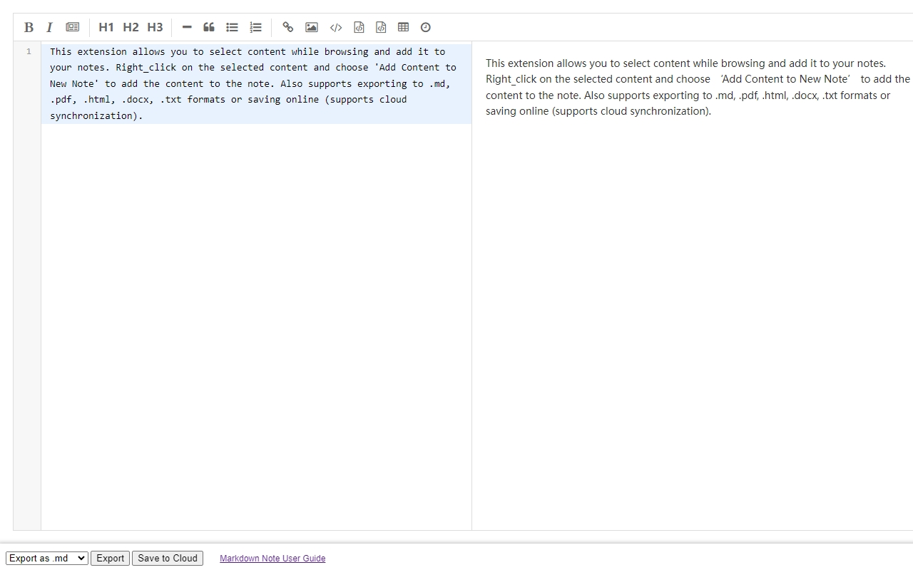
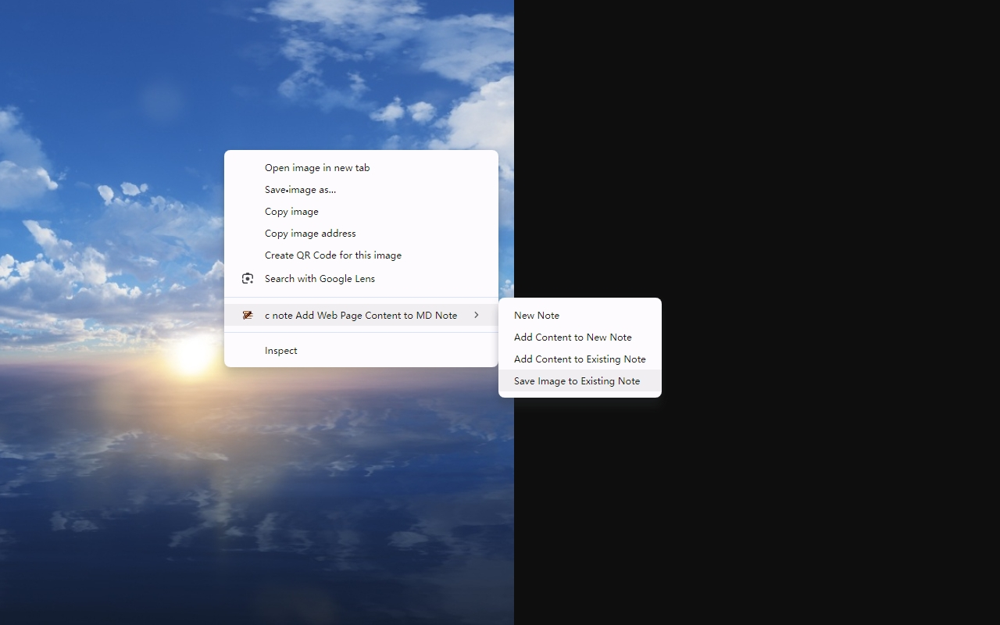
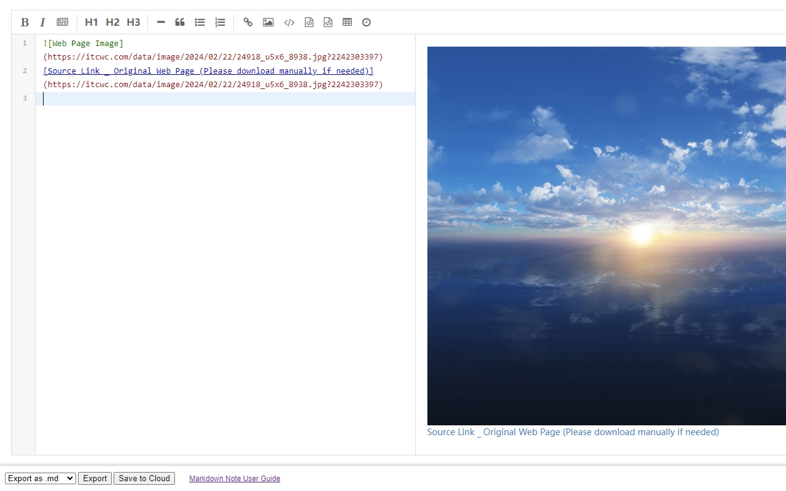
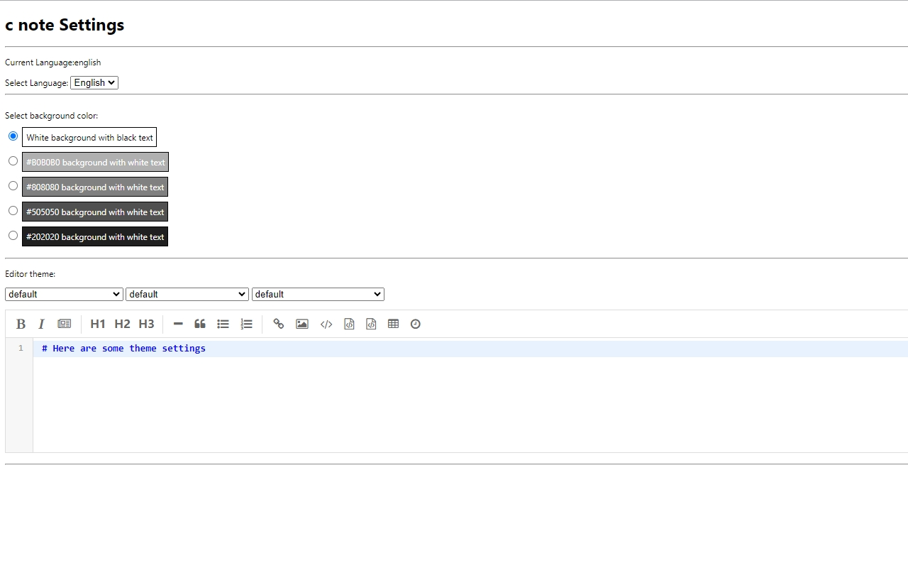

### itcwc-note[Web Note Extension]

    【English   |   <a href="readme/README-Chinese.md">中文</a>】

#### Features:
* Welcome to the **C Note** extension!
* This extension allows you to select content while browsing the web and add it to your notes.
* Simply right-click on the selected content and choose "Add content to a new note" to save it.
* Supports exporting to `.md, .pdf, .html, .docx, .txt` formats or saving online with cloud sync support (coming soon~).

#### Installation Instructions:
* 1. Download the extension locally.
* 2. Open Google Chrome.
* 3. Go to Settings -> Extensions -> Enable **Developer mode** -> Load unpacked extension -> Select the downloaded files.
* 4. Installation complete.
* 5. Or [Edge browser](https://microsoftedge.microsoft.com/addons/detail/c-note-add-web-page-conte/bdcofhehaohhfckpelmkkpmigoemecpp)

#### Screenshots:
* Add text to notes  
  

* Editor  
  

* Add image to notes  
  

* Image in editor  
  

* Settings  
  