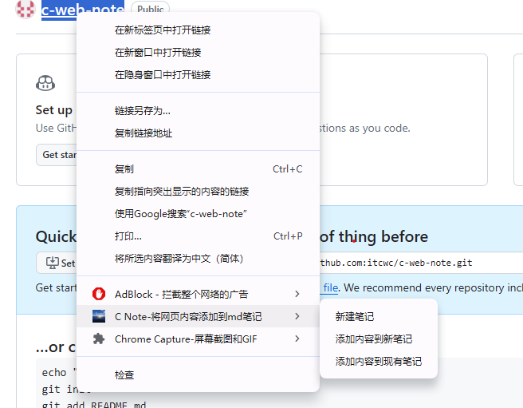
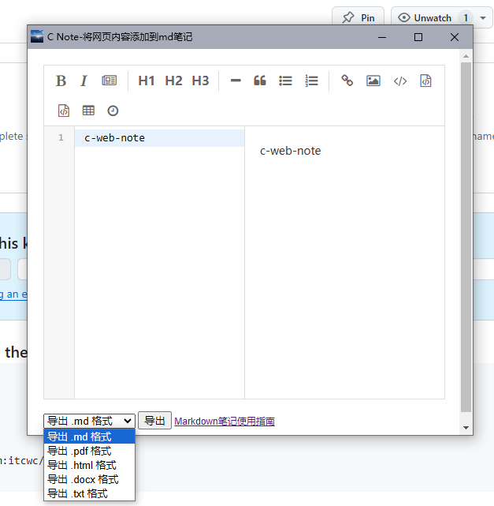
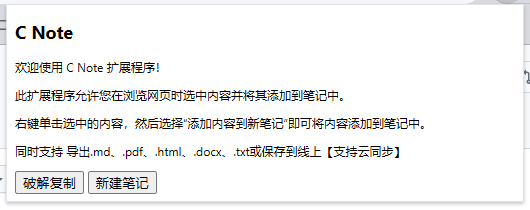

### itcwc-note[谷歌网页笔记插件]

* 功能介绍：
  * 欢迎使用 c note 扩展程序！
  * 此扩展程序允许您在浏览网页时选中内容并将其添加到笔记中。
  * 右键单击选中的内容，然后选择“添加内容到新笔记”即可将内容添加到笔记中。
  * 同时支持导出：`.md、.pdf、.html、.docx、.txt`或保存到线上【支持云同步，待开发~】

* 安装方法：
  * 下载到本地
  * 打开谷歌浏览器
  * 点击设置->扩展程序->打开【开发者模式】->加载已解压的扩展程序->选择下载的压缩包
  * 完成安装

* 截图
  * 侧键
  
    

  * 编辑器

    

  * 基础介绍
  
    