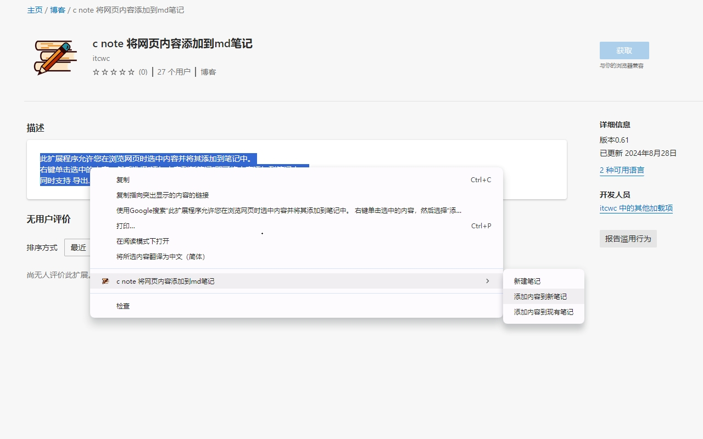
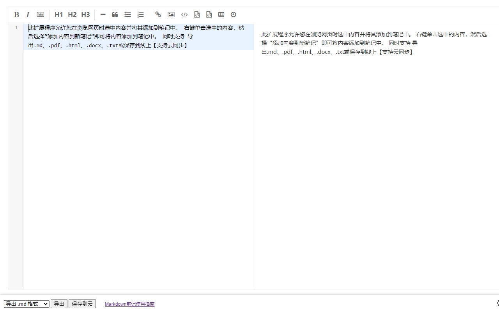
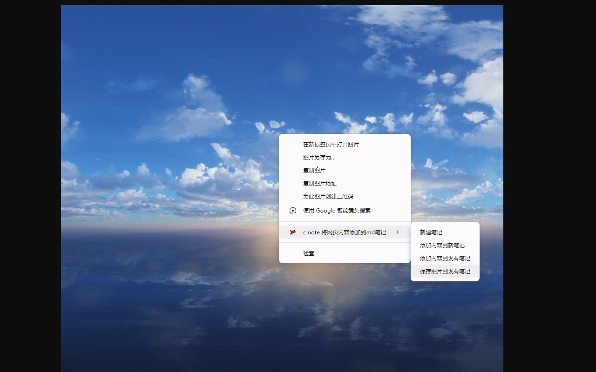
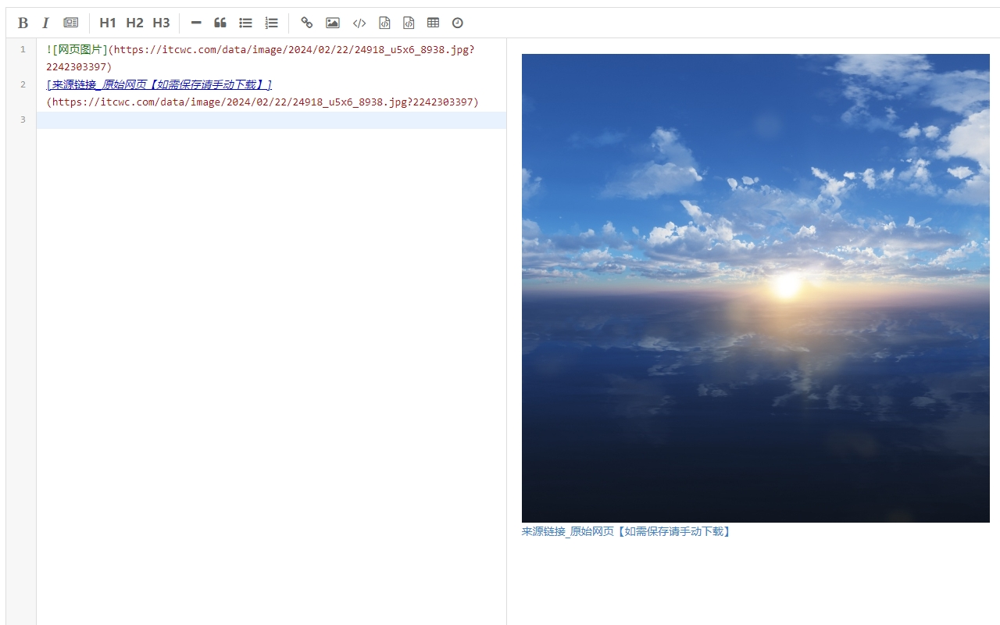
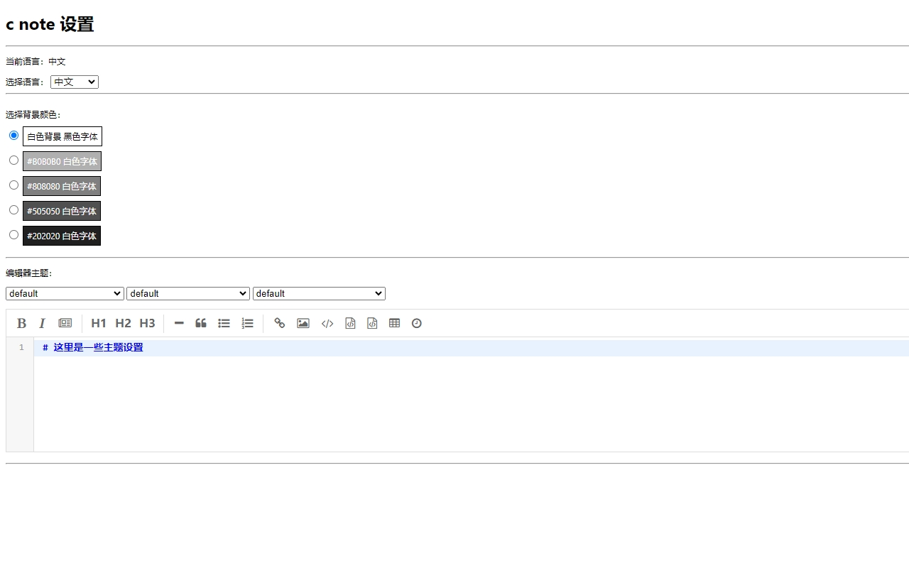

### itcwc-note[网页笔记插件]

    【<a href="/README.md">English</a>   |   中文】

#### 功能介绍：
* 欢迎使用 c note 扩展程序！
* 此扩展程序允许您在浏览网页时选中内容并将其添加到笔记中。
* 右键单击选中的内容，然后选择“添加内容到新笔记”即可将内容添加到笔记中。
* 同时支持导出：`.md、.pdf、.html、.docx、.txt`或保存到线上【支持云同步，待开发~】

#### 安装方法：
* 1. 下载到本地
* 2. 打开谷歌浏览器
* 3. 点击设置->扩展程序->打开【开发者模式】->加载已解压的扩展程序->选择下载的文件
* 4. 完成安装
* 5. 或者 [Edge 浏览器](https://microsoftedge.microsoft.com/addons/detail/c-note-add-web-page-conte/bdcofhehaohhfckpelmkkpmigoemecpp)

#### 截图
* 添加文字到笔记
  

* 编辑文字
  

* 添加图片到笔记
  

* 编辑图片
  

* 设置
  